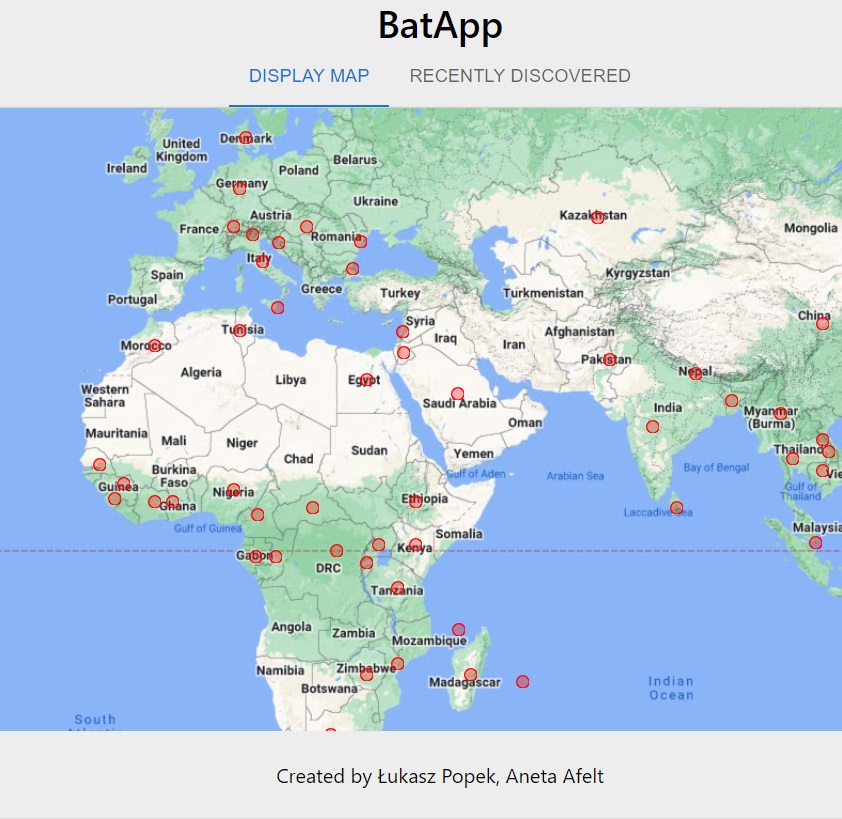
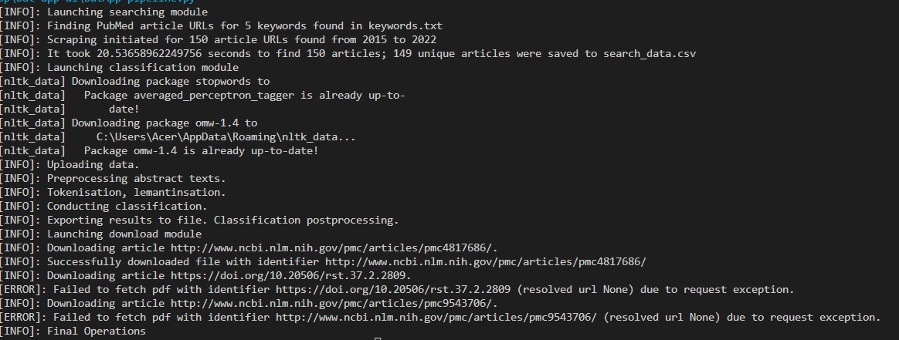

# BatApp



## What it does?

The project aimed to create a virtual hotspot map of new coronavirus discoveries in bat species. It consists of two parts - an AI module to search and download scientific articles to pdf files, and a module with visualisation being deployed at [BatAppLink](https://lpopek.github.io/BatApp/). Currently displayed data were gained with scraping information form [DBatvir](http://www.mgc.ac.cn/DBatVir/), a chinnes DataBase, wchich presents state of the art of recent Coronavirus apperences around the World.

## AI MODULE

### Required packages

* [Python](https://docs.python.org/3.9/) >= 3.9.2
* [BeautifullSoup](https://www.crummy.com/software/BeautifulSoup/bs4/doc/) >= 4.9.0
* [Pandas](https://pandas.pydata.org/) >= 1.5.0
* [requests](https://pypi.org/project/requests/) >= 2.28.1
* [asyncio](https://docs.python.org/3/library/asyncio.html) >= 3.11.0
* [aiohttp](https://docs.aiohttp.org/en/stable/) >= 3.8.3
* [NLTK](https://www.nltk.org/) >= 3.7 with models/datatests: stopwords, wordnet, punkt, wveragged_perceprtron_tagger, owm-1.4
* [re](https://docs.python.org/3/library/re.html) >= 2.2.1
* [joblib](https://joblib.readthedocs.io/en/latest/) >= 1.2.0

## How to use it?

1. install dependencies:

   ```sh
   pip install -r requirements.txt
   ```

2. open command prompt and change directory to the folder containing BatApp-pipline.py and folder with data
3. using the AI module for a different type of problem, prepare a representative collection containing the contents of the abstracts of the scientific articles under which the classifier is to be trained. Notepad is used for this: BatApp-NLP-clasificator.ipynb
4. create a folder in which to save the article files
5. run the BatApp-pipeline.py script using the command:

   ```sh
   ./BatApp-pipeline.py --start <int> --stop <int> --pages <int> --dir <str> 
   ```

  with args:

* --start lower limit of search interval
* --stop upper limit of saerch interval
* --pages limit of pages, which program will search through in Pubmed
* --dir the directory for saving data

Trained classificators one can foound in folder bat-app-ai/cls. Downloaded results will be stored in saving directory. 

### Usage Example

When the program is lauched proper execution should look familiar with below printscreen of logs.



## Visualisation Module

### Contribution

In the project directory, you can run:

#### `npm start`

Runs the app in the development mode.\
Open [http://localhost:3000](http://localhost:3000) to view it in your browser.

The page will reload when you make changes.\
You may also see any lint errors in the console.

#### `npm test`

Launches the test runner in the interactive watch mode.\
See the section about [running tests](https://facebook.github.io/create-react-app/docs/running-tests) for more information.

#### `npm run build`

Builds the app for production to the `build` folder.\
It correctly bundles React in production mode and optimizes the build for the best performance.

The build is minified and the filenames include the hashes.\
Your app is ready to be deployed!

See the section about [deployment](https://facebook.github.io/create-react-app/docs/deployment) for more information.
